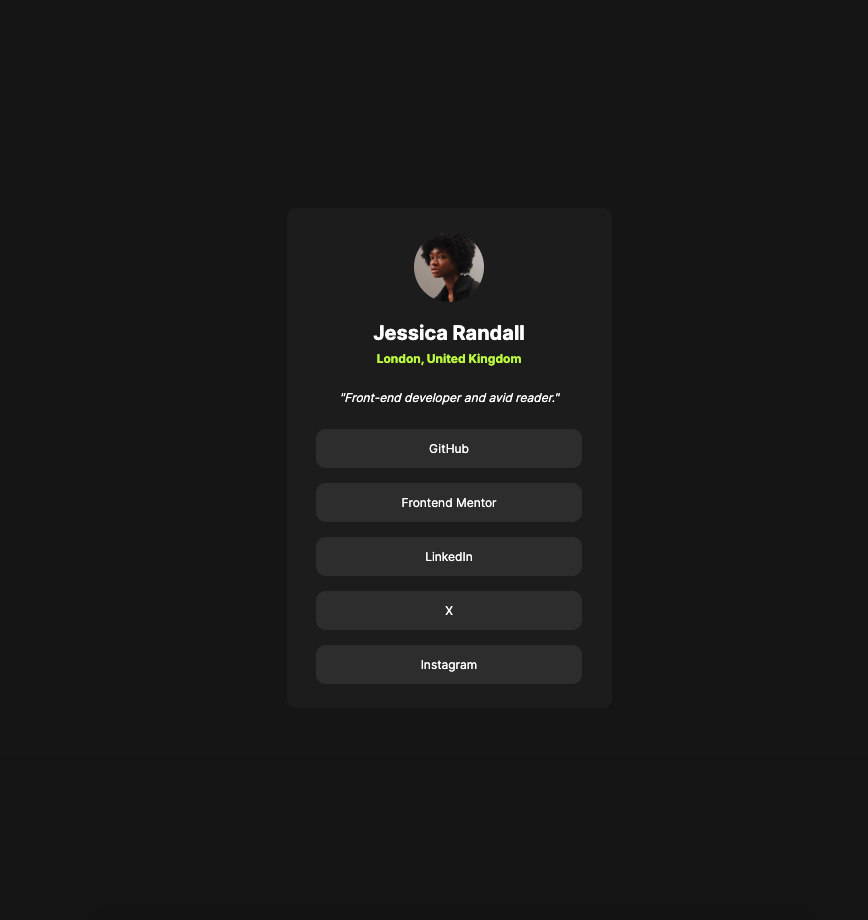

# Frontend Mentor - Social links profile solution

This is a solution to the [Social links profile challenge on Frontend Mentor](https://www.frontendmentor.io/challenges/social-links-profile-UG32l9m6dQ). Frontend Mentor challenges help you improve your coding skills by building realistic projects. 

## Table of contents

- [Overview](#overview)
  - [The challenge](#the-challenge)
  - [Screenshot](#screenshot)
  - [Links](#links)
  - [Built with](#built-with)
  - [Continued development](#continued-development)
- [Author](#author)

## Overview

Build out a social link-sharing profile

### The challenge

Users should be able to:

- See hover and focus states for all interactive elements on the page

### Screenshot

### Links

- Solution URL: [Solutuion](https://github.com/atreska/social-links-profile)
- Live Site URL: [Live Site](https://atreska.github.io/social-links-profile/)

### Built with

- Semantic HTML5 markup
- Flexbox
- Mobile-first workflow

### Continued development

I want to continue focusing on semantic HTML, CSS components, CSS Grid, React

## Author

- GitHub - [@atreska](https://github.com/atreska)
- Frontend Mentor - [@atreska](https://www.frontendmentor.io/profile/atreska)
